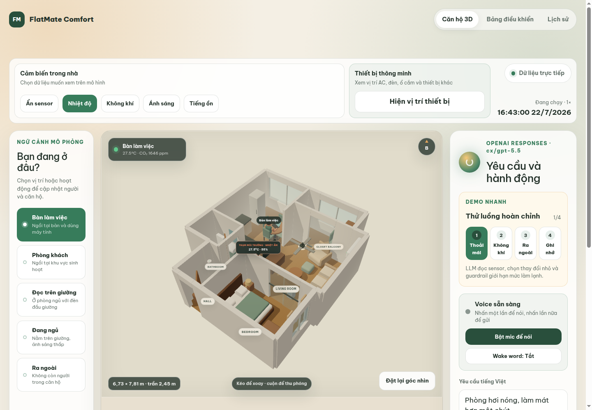
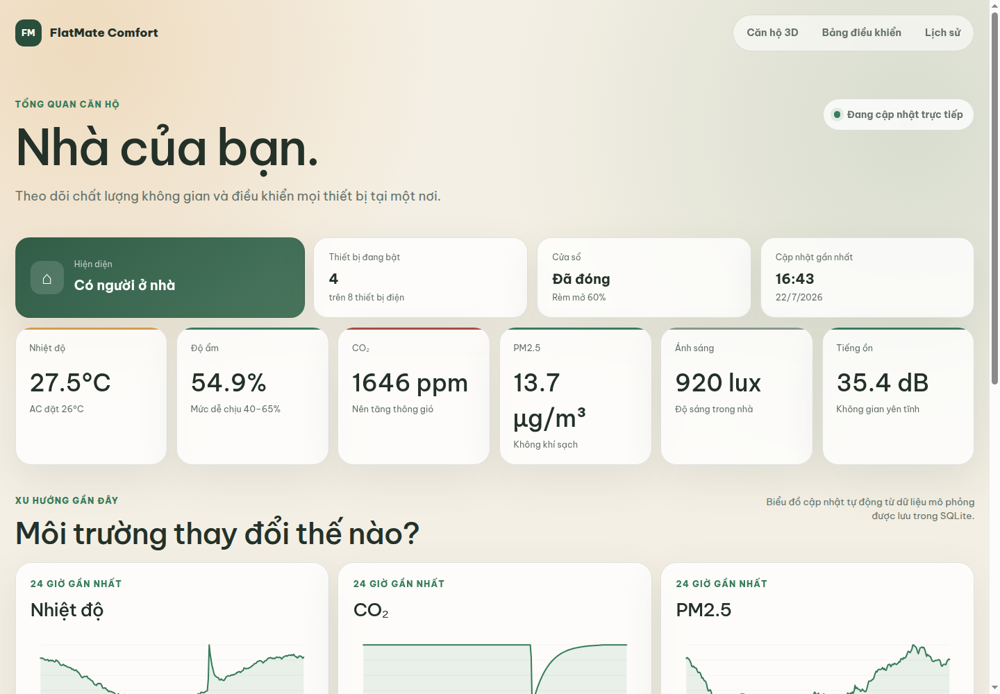
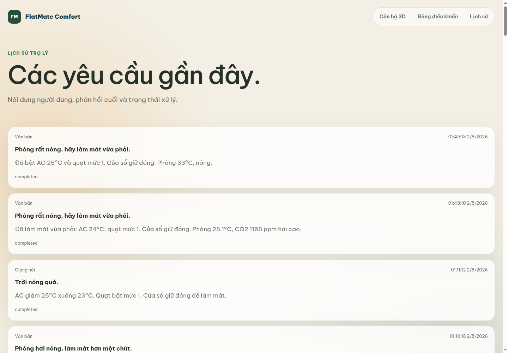

# FlatMate Comfort

[Đọc báo cáo kỹ thuật tiếng Việt](https://khang-water.github.io/aiot-flatmate-comfort/)

FlatMate Comfort là đồ án AIoT môn NT532, mô phỏng căn hộ thông minh một phòng ngủ có khả năng cá nhân hóa. Python sinh dữ liệu cảm biến và trạng thái thiết bị; giao diện web tiếng Việt dựng bản sao số 3D theo kích thước, nhận yêu cầu văn bản hoặc giọng nói, hiển thị các bước xử lý của trợ lý, cung cấp bảng theo dõi và học sở thích từ cả yêu cầu rõ ràng lẫn thao tác chỉnh lại kết quả của trợ lý.

Hệ thống không sử dụng thiết bị vật lý. MQTT, ESP32, Home Assistant, cảnh báo an toàn, xác thực và tích hợp thiết bị thật nằm ngoài phạm vi phiên bản hiện tại.

## Giao diện

### Bản sao số 3D của căn hộ



### Bảng theo dõi và điều khiển



### Lịch sử trợ lý



## Trạng thái hiện tại

Sản phẩm gồm bộ máy mô phỏng tất định, lịch sử SQLite, bộ nhớ sở thích có cấu trúc, implicit-feedback từ manual override, cập nhật trạng thái qua SSE, bản sao số căn hộ một phòng ngủ, lớp phủ cảm biến và thiết bị, chọn ngữ cảnh hiện diện, bảng theo dõi 24 giờ, điều khiển có quy tắc bảo vệ và voice mode theo môi trường. Localhost dùng `MediaRecorder`, faster-whisper, VieNeu và Supertonic; bản Render dùng `SpeechRecognition` cho ASR và Piper `vi_VN-vais1000-medium` trên backend cho TTS tiếng Việt ổn định.

Backend xác định context và preference trước khi gọi model, ép lệnh có giá trị cụ thể sang `explicit`, chuẩn hóa đèn vàng/trắng ấm thành `2700K`, và sinh câu xác nhận từ thay đổi thực tế. Khi chuẩn bị làm việc trong phòng thiếu sáng, scene tối thiểu bật máy tính, màn hình và đèn chính; preference đúng context được ưu tiên.

Khi người dùng chỉnh thủ công đúng thuộc tính vừa được trợ lý thay đổi trong vòng 30 phút mô phỏng, backend lưu một evidence theo context hiện tại. Ba override có cùng target mới kích hoạt preference nguồn `learned`; một chỉnh sửa đơn lẻ chưa ảnh hưởng request sau.

Thao tác không hợp lệ hoặc yêu cầu trợ lý thất bại không làm thay đổi trạng thái căn hộ. Khi chưa cấu hình `OPENAI_API_KEY`, mô phỏng, bảng theo dõi và điều khiển thủ công vẫn hoạt động; local speech endpoint vẫn có thể kiểm tra độc lập.

Kết quả kiểm tra hiện tại: 62 phép kiểm thử phía máy chủ đạt, 1 phép kiểm thử phụ thuộc môi trường được bỏ qua; Ruff, kiểm tra miền dữ liệu giao diện, TypeScript, bản dựng sản xuất và Docker smoke test đều đạt.

## Công nghệ

- Giao diện: Next.js, TypeScript, CSS thích ứng và React Three Fiber.
- API: Python 3.11, FastAPI và Pydantic.
- Cập nhật trực tiếp: Server-Sent Events.
- Lưu trữ: SQLite bền vững trên máy cá nhân; filesystem tạm thời trên Render Free.
- Dữ liệu: tệp CSV sinh tất định và kịch bản JSON.
- Nhận dạng giọng nói: localhost dùng `MediaRecorder` + faster-whisper `small`; deployment dùng Web Speech `SpeechRecognition` với `vi-VN`.
- Tổng hợp giọng nói: localhost dùng VieNeu v3 Turbo ONNX `int8` + Supertonic fallback; deployment dùng Piper `vi_VN-vais1000-medium` qua `/api/tts`.
- Trợ lý: OpenAI Responses API với công cụ hàm có cấu trúc.
- Triển khai: Docker và bản thiết kế Render.

## Tài liệu

- [Báo cáo kỹ thuật hoàn chỉnh](REPORT.md)
- [Báo cáo Word](deliverables/FlatMate-Comfort-NT532-Technical-Report.docx)
- [Đề bài NT532 đã chuyển sang Markdown](docs/source/NT532-Project-Instruction.md)
- [Sơ đồ kiến trúc có thể chỉnh sửa](docs/figures/flatmate-system-architecture.drawio)
- [Ảnh sơ đồ kiến trúc](docs/figures/flatmate-system-architecture.png)
- [Đặc tả sản phẩm](docs/product-spec.md)
- [Kiến trúc hệ thống](docs/architecture.md)
- [Luồng giao diện và tương tác](docs/ui-flows.md)
- [Hợp đồng API](docs/api-contract.md)
- [Thiết kế mô phỏng](docs/simulation-design.md)
- [Các giai đoạn triển khai](docs/phases.md)
- [Hướng dẫn triển khai](docs/deployment.md)
- [Thông báo giấy phép thành phần bên thứ ba](THIRD_PARTY_NOTICES.md)

Đề xuất phần cứng ban đầu vẫn được giữ tại [plan.md](plan.md) để tham khảo. Phạm vi mô phỏng đã duyệt trong thư mục `docs/` được ưu tiên khi có nội dung khác nhau.

Báo cáo không tự suy đoán MSSV hoặc thông tin thành viên còn thiếu. Cần bổ sung các trường này trước khi nộp.

## Chạy trên máy cá nhân

Yêu cầu: Node.js 20 trở lên, npm, Python 3.11 trở lên và `uv`.

```bash
cp .env.example .env
make install
make dev
```

Các địa chỉ mặc định:

- `http://localhost:3000`: bản sao số 3D.
- `http://localhost:3000/dashboard`: bảng theo dõi và điều khiển.
- `http://localhost:3000/history`: lịch sử trợ lý.
- `http://localhost:8000`: FastAPI.
- `http://localhost:8000/docs`: tài liệu OpenAPI.

Chạy toàn bộ kiểm tra:

```bash
make check
```

Khi `make dev` đang chạy, kiểm tra API, quy tắc bảo vệ, SSE và các trang web:

```bash
make smoke
```

## Triển khai toàn bộ trên Render

`render.yaml` tạo một dịch vụ Docker trên Render Free. Next.js được build với `NEXT_PUBLIC_SPEECH_MODE=browser` cho ASR và `NEXT_PUBLIC_TTS_MODE=backend` cho TTS. FastAPI chỉ cài extra `piper`, bundle model medium đã ghim SHA-256, đặt `LOCAL_ASR_ENABLED=false` và trả WAV từ `/api/tts`. `.dockerignore` chặn local virtualenv và `node_modules` khỏi build context.

### Các bước triển khai

1. Mở [trang tạo Render Blueprint](https://render.com/deploy?repo=https://github.com/Khang-Water/aiot-flatmate-comfort).
2. Đăng nhập Render và kết nối kho mã GitHub.
3. Nhập `OPENAI_API_KEY`, `OPENAI_BASE_URL` và `OPENAI_MODEL` theo cấu hình đang hoạt động. Nếu dùng OpenAI trực tiếp, có thể để trống `OPENAI_BASE_URL`.
   Blueprint dùng `OPENAI_API_MODE=chat_completions`; localhost mặc định dùng Responses API.
4. Xác nhận bản thiết kế và chờ ảnh Docker được dựng.
5. Mở URL Render được cấp; điểm kiểm tra trạng thái nằm tại `/api/health`, tài liệu OpenAPI tại `/docs`.

Render Free không có persistent disk. SQLite tại `/tmp/flatmate.db`, conversation, history và preference đã học có thể mất sau deploy hoặc restart. Dùng gói trả phí kèm disk khi cần dữ liệu bền vững.

Service Free có thể spin down khi không hoạt động; request đầu sau đó chịu cold start.

`SpeechRecognition` không được hỗ trợ đồng đều trên mọi trình duyệt. Text input luôn còn dùng được; TTS không còn phụ thuộc voice cài trên browser/OS.

Không đưa `OPENAI_API_KEY` vào mã nguồn, ảnh Docker hoặc biến môi trường giao diện. Khóa bí mật chỉ được nhập trong bảng điều khiển Render.
