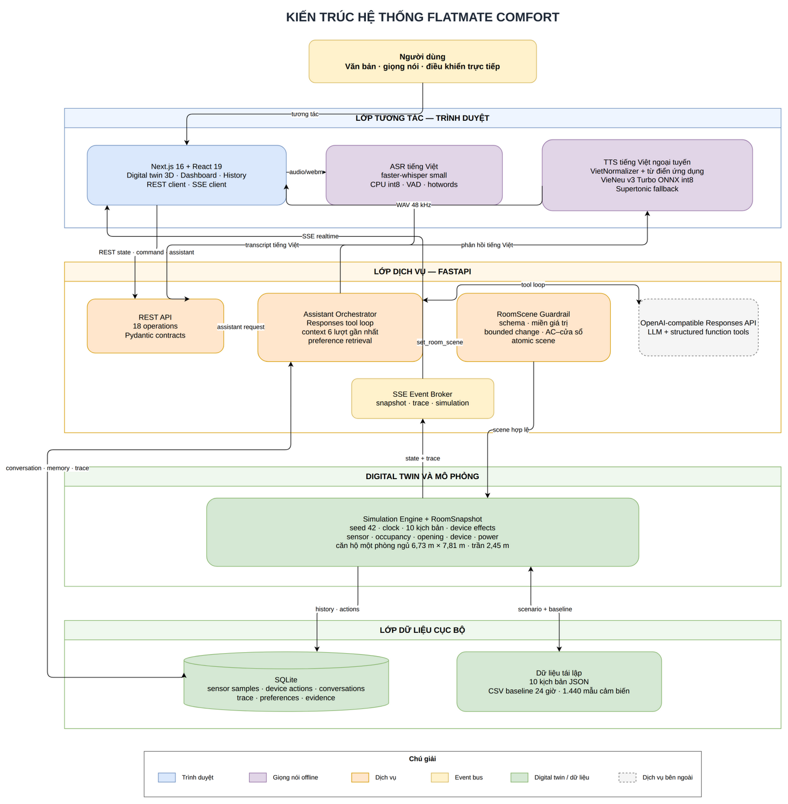

# BÁO CÁO KỸ THUẬT ĐỒ ÁN NT532

## FLATMATE COMFORT — DIGITAL TWIN CĂN HỘ THÔNG MINH CÁ NHÂN HÓA

**Học phần:** Advanced Internet of Things Technologies (NT532) \
**Đơn vị:** Faculty of Computer Networks & Communications, UIT — VNU-HCM \
**Giảng viên:** Thuat NGUYEN-KHANH \
**Sinh viên thực hiện:** Khang Lê \
**MSSV:** Chưa được cung cấp trong repository \
**Thành viên thứ hai:** Chưa được cung cấp trong repository \
**Ngày cập nhật báo cáo:** 09/08/2026

> Tài liệu hướng dẫn yêu cầu thông tin đầy đủ của tác giả và nhóm hai thành viên. Báo cáo không tự suy đoán MSSV hoặc danh tính thành viên còn thiếu; các trường trên cần được bổ sung trước khi nộp bản chính thức.

## Mục lục

1. [Giới thiệu](#1-giới-thiệu)
2. [Phạm vi và yêu cầu hệ thống](#2-phạm-vi-và-yêu-cầu-hệ-thống)
3. [Related work](#3-related-work)
4. [Kiến trúc hệ thống](#4-kiến-trúc-hệ-thống)
5. [Digital twin căn hộ một phòng ngủ](#5-digital-twin-căn-hộ-một-phòng-ngủ)
6. [Trợ lý AI và guardrail](#6-trợ-lý-ai-và-guardrail)
7. [Bộ nhớ và cá nhân hóa](#7-bộ-nhớ-và-cá-nhân-hóa)
8. [Xử lý giọng nói tiếng Việt](#8-xử-lý-giọng-nói-tiếng-việt)
9. [Phân tích mã nguồn](#9-phân-tích-mã-nguồn)
10. [Demonstration, logs và numerical results](#10-demonstration-logs-và-numerical-results)
11. [Đánh giá](#11-đánh-giá)
12. [Triển khai và vận hành](#12-triển-khai-và-vận-hành)
13. [Hướng phát triển](#13-hướng-phát-triển)
14. [Kết luận](#14-kết-luận)
15. [Tài liệu tham khảo](#tài-liệu-tham-khảo)

## Tóm tắt

FlatMate Comfort là nguyên mẫu AIoT mô phỏng một căn hộ một phòng ngủ. Hệ thống kết hợp digital twin 3D, dữ liệu cảm biến sinh theo thời gian, trạng thái thiết bị, ngữ cảnh hiện diện và bộ nhớ sở thích để chuyển yêu cầu tiếng Việt thành tập giá trị điều khiển có cấu trúc. Người dùng có thể nhập văn bản, nói qua microphone hoặc điều khiển thiết bị trực tiếp. Trợ lý đọc `RoomSnapshot`, truy xuất preference phù hợp, gọi structured function tools, kiểm tra guardrail và chỉ cập nhật mô phỏng khi toàn bộ scene hợp lệ. Manual override sau một hành động của trợ lý còn được ghi thành implicit evidence; ba target giống nhau trong cùng context mới kích hoạt preference nguồn `learned`.

Backend được xây dựng bằng FastAPI, Pydantic và SQLite. Simulation engine chạy xác định với seed cố định, duy trì lịch sử 24 giờ và phát trạng thái qua Server-Sent Events (SSE). Frontend Next.js sử dụng React Three Fiber để dựng căn hộ, nội thất, người dùng, sensor overlay, dashboard và conversation history. Speech có hai mode: localhost dùng faster-whisper `small` trên CPU `int8`, VieNeu-TTS v3 Turbo ONNX `int8` và Supertonic fallback; bản Render Free dùng `SpeechRecognition` cho ASR và Piper `vi_VN-vais1000-medium` trên backend cho TTS.

Kết quả kiểm tra tại thời điểm báo cáo gồm 71 test backend đạt, 1 test bỏ qua theo điều kiện môi trường, Ruff đạt, TypeScript đạt, production build và Docker smoke test thành công. Dataset baseline có 1.440 mẫu cảm biến, tương ứng một mẫu mỗi phút trong 24 giờ. Một lần chạy end-to-end trên kịch bản `hot_room` đã chuyển trạng thái từ AC tắt ở 27°C và quạt tắt sang AC bật ở 25°C, quạt mức 1; cửa sổ giữ đóng. TTS local greedy tạo câu 2,80 giây với thời gian trung bình 2,99 giây qua ba lượt; container Piper bị giới hạn đúng 512 MB và 0,1 CPU tạo câu 3,855 giây trong 17,12 giây ở lượt lazy-load đầu, 1,49 giây ở lượt warm và dùng 254,3 MiB RSS cho toàn service.

**Từ khóa:** AIoT, digital twin, smart apartment, personalization, LLM tool calling, context memory, sensor simulation, Vietnamese ASR, offline TTS.

## 1. Giới thiệu

### 1.1. Bối cảnh

Hệ thống nhà thông minh truyền thống thường xử lý lệnh trực tiếp hoặc automation rule cố định, chẳng hạn “bật điều hòa” hoặc “nếu nhiệt độ vượt 30°C thì bật quạt”. Cách tiếp cận này phù hợp với hành vi rõ ràng nhưng khó xử lý yêu cầu phụ thuộc ngữ cảnh:

- “Phòng rất nóng, làm mát vừa phải.”
- “Tôi chuẩn bị làm việc.”
- “Không khí hơi ngột ngạt.”
- “Tối nay giữ phòng ấm hơn bình thường.”
- “Tôi đi ra ngoài, tắt các thiết bị điện.”

Cùng một yêu cầu có thể dẫn đến kết quả khác nhau tùy nhiệt độ, độ ẩm, CO₂, PM2.5, ánh sáng, vị trí người dùng, cửa sổ, thiết bị đang hoạt động và preference đã lưu. FlatMate Comfort đặt một lớp điều phối giữa người dùng và hạ tầng IoT:

```text
Yêu cầu ngôn ngữ tự nhiên
+ RoomSnapshot
+ ngữ cảnh hiện diện
+ preference đang có hiệu lực
+ hội thoại và hành động gần đây
        ↓
structured tool call
        ↓
guardrail + atomic scene validation
        ↓
trạng thái digital twin mới
```

### 1.2. Phát biểu bài toán

Đầu ra điều khiển được mô tả bằng hàm:

```text
A = f(R, S, D, C, P, H)
```

Trong đó:

- `R`: yêu cầu văn bản hoặc transcript tiếng Việt.
- `S`: sensor data của môi trường và hiện diện.
- `D`: device state hiện tại.
- `C`: context như `working`, `relaxing`, `sleeping`, `reading_in_bed` hoặc `away`.
- `P`: preference đã xác nhận và chưa hết hạn.
- `H`: tối đa sáu lượt hội thoại hoàn tất gần nhất cùng session và recent device actions khi cần.
- `A`: tập target có kiểu dữ liệu, miền giá trị và quan hệ ràng buộc rõ ràng.

Ví dụ output nội bộ:

```json
{
  "change_mode": "bounded",
  "ac_power": true,
  "ac_temperature_c": 25,
  "fan_power": true,
  "fan_speed": 1,
  "window_state": "closed",
  "reason": "Phòng nóng; làm mát vừa phải bằng AC và quạt nhẹ."
}
```

### 1.3. Mục tiêu

1. Mô phỏng đầy đủ chu trình `sensing → processing → actuation → monitoring` mà không cần phần cứng thật.
2. Dựng digital twin một căn hộ một phòng ngủ theo floor plan có kích thước và độ tin cậy được ghi rõ.
3. Cho phép trợ lý hiểu yêu cầu tiếng Việt và chọn structured tools thay vì backend phân loại bằng danh sách từ khóa.
4. Giữ mọi thay đổi thiết bị trong miền hợp lệ và áp dụng nguyên tử.
5. Cá nhân hóa bằng explicit preference, temporary preference, correction evidence và implicit feedback từ manual override.
6. Hỗ trợ push-to-talk và TTS tiếng Việt bằng local model hoặc Piper backend theo môi trường.
7. Trình bày trạng thái, trace, lịch sử và kết quả mô phỏng trên website responsive.

### 1.4. Đóng góp chính

- Digital twin 3D có bố cục căn hộ một phòng ngủ, nội thất, người dùng và vị trí sensor/device.
- Simulation engine xác định được, có 10 scenario và baseline 24 giờ.
- Assistant orchestration dùng Responses API, structured function tools và observable trace.
- Guardrail kiểm tra schema, range, bounded change, xung đột thiết bị và atomicity.
- Preference store có context, intent, expiry, confidence, evidence, `last_used_at` và promotion threshold cho implicit feedback.
- Speech pipeline tiếng Việt có local mode đầy đủ và browser mode nhẹ cho deployment.
- Bộ kiểm thử backend, contract, frontend geometry, voice, privacy và accessibility.

## 2. Phạm vi và yêu cầu hệ thống

### 2.1. Trong phạm vi

- Một người dùng, một căn hộ một phòng ngủ và một simulation process.
- Cảm biến và thiết bị được mô phỏng bằng Python.
- Text request, push-to-talk, TTS, manual controls và scenario activation.
- REST API cho command/query; SSE cho snapshot và trace realtime.
- SQLite cho history, action, conversation, trace và preference.
- Implicit-feedback pipeline nối manual override với assistant action gần nhất theo property và context.
- LLM qua OpenAI-compatible Responses API.
- Frontend tiếng Việt trên desktop, tablet và mobile.

### 2.2. Ngoài phạm vi

- ESP32, Raspberry Pi, MQTT broker, Home Assistant integration hoặc thiết bị vật lý.
- Camera, khóa cửa, báo cháy, báo gas, cảnh báo khẩn cấp và mobile push.
- Authentication, multi-user, multi-apartment và phân quyền.
- Điều khiển an toàn cấp công nghiệp hoặc medical-grade.
- Học thụ động từ sensor hoặc thao tác không liên hệ được với assistant action trước đó.
- Kích hoạt preference implicit từ một quan sát đơn lẻ.

### 2.3. Yêu cầu chức năng

| Mã | Yêu cầu |
| --- | --- |
| FR-01 | Đọc snapshot gồm môi trường, hiện diện, opening, power và device state |
| FR-02 | Kích hoạt, pause, resume, reset và đổi tốc độ simulation |
| FR-03 | Điều khiển từng thiết bị bằng command đã kiểm tra |
| FR-04 | Nhận yêu cầu text/voice và phát assistant trace |
| FR-05 | Lưu, cập nhật, xóa và reset preference từ explicit request, correction và implicit manual override |
| FR-06 | Hiển thị digital twin, dashboard 24 giờ và conversation history |
| FR-07 | Tạo transcript và speech tiếng Việt bằng provider phù hợp môi trường |

### 2.4. Yêu cầu phi chức năng

- **Determinism:** cùng seed và cùng chuỗi action phải tái tạo được dữ liệu.
- **Atomicity:** scene có một field sai không được cập nhật dở dang.
- **Observability:** chỉ hiển thị event, tool, validation và rationale ngắn; không hiển thị private chain-of-thought.
- **Graceful degradation:** lỗi microphone, TTS, WebGL hoặc LLM không làm mất text response hay state đã xác nhận.
- **Privacy boundary:** local mode xử lý audio trong backend cục bộ; browser mode có thể dùng dịch vụ nhận dạng của nhà cung cấp trình duyệt. App server chỉ nhận transcript, còn transcript và snapshot cần thiết có thể được gửi tới LLM bên ngoài khi assistant được sử dụng.
- **Accessibility:** giao diện có text equivalent khi 3D/WebGL không khả dụng.

## 3. Related work

### 3.1. Home Assistant

Home Assistant là nền tảng home automation mã nguồn mở, ưu tiên local control và privacy, với kiến trúc component để tích hợp nhiều loại thiết bị [2]. FlatMate Comfort không thay thế Home Assistant và hiện không có device integration thật. Điểm tập trung của đề tài là mô phỏng có kiểm soát, giải thích luồng quyết định và cá nhân hóa yêu cầu mơ hồ bằng LLM.

### 3.2. Eclipse Ditto

Eclipse Ditto triển khai digital twin pattern cho IoT, trong đó software representation phản ánh trạng thái của real-world thing [3]. FlatMate Comfort áp dụng cùng tư tưởng representation nhưng thu hẹp vào một căn hộ một phòng ngủ. `RoomSnapshot` là authoritative in-memory state, còn website là visualization và interaction layer. Mô hình hiện tại không hướng tới distributed twin registry hoặc cloud-scale tenancy.

### 3.3. Mem0 và memory layer cho AI assistant

Mem0 cung cấp memory layer tổng quát với user/session/agent memory và retrieval nhiều tín hiệu [4]. FlatMate Comfort không dùng vector database hoặc semantic embedding. Bộ nhớ được thiết kế theo domain smart apartment: mỗi record có `context`, `requested_intent`, typed `preferred_result`, `source`, `confidence`, expiry và evidence. Cách này giảm độ linh hoạt nhưng tăng khả năng kiểm tra, giải thích và ánh xạ trực tiếp sang device targets.

### 3.4. So sánh định hướng

| Hệ thống | Mục tiêu chính | Device integration | Digital twin | Personalized memory | Vị trí của FlatMate Comfort |
| --- | --- | --- | --- | --- | --- |
| Home Assistant | Home automation thực tế | Rất rộng | Entity/state model | Automation/user config | Không cạnh tranh; có thể trở thành adapter tương lai |
| Eclipse Ditto | Digital twin platform | Qua connectivity layer | Tổng quát, cloud-oriented | Không phải trọng tâm | Dùng pattern ở quy mô căn hộ nhỏ |
| Mem0 | Memory cho AI application | Không chuyên IoT | Không | Tổng quát, semantic | Tham chiếu cho hướng mở rộng memory |
| FlatMate Comfort | AIoT personalization demo | Mô phỏng | Căn hộ 3D + RoomSnapshot | Structured SQLite preference | Tối ưu cho demo kiểm chứng được |

## 4. Kiến trúc hệ thống



Nguồn chỉnh sửa: [`docs/figures/flatmate-system-architecture.drawio`](docs/figures/flatmate-system-architecture.drawio).

Hình 1 mô tả local mode đầy đủ. Trên Render Free, ASR offline được thay bằng `SpeechRecognition`; TTS dùng Piper medium qua cùng endpoint `/api/tts`.

### 4.1. Lớp tương tác

Frontend dùng Next.js 16, React 19, Three.js và React Three Fiber. Trang `/` hiển thị digital twin và assistant; `/dashboard` hiển thị metric, chart và manual controls; `/history` hiển thị conversation. `NEXT_PUBLIC_SPEECH_MODE` chọn `MediaRecorder` hoặc browser recognition; `NEXT_PUBLIC_TTS_MODE` chọn backend WAV hoặc browser synthesis. Render dùng browser ASR và backend TTS. `EventSource` nhận SSE ở cả hai mode.

### 4.2. Lớp dịch vụ

FastAPI cung cấp 18 API operations. Pydantic model đặt `extra="forbid"` để từ chối field ngoài contract. `AssistantOrchestrator` quản lý tối đa năm vòng tool call, giới hạn conversation context ở sáu lượt hoàn tất gần nhất và chỉ cho phép một pending scene trong một request.

### 4.3. Lớp digital twin và mô phỏng

`SimulationEngine` sở hữu `RoomSnapshot`, simulation clock, active scenario và state transition. Mỗi command được preview và validate trước khi state authoritative thay đổi. Sau manual command hợp lệ, engine chuyển command ID, context, field được cung cấp và changed values sang storage để kiểm tra implicit feedback. `EventBroker` phát snapshot, trace và simulation event theo sequence tăng dần.

### 4.4. Lớp dữ liệu

SQLite lưu:

- `sensor_samples`
- `device_actions`
- `simulation_events`
- `conversations`
- `assistant_trace_events`
- `preferences`
- `preference_evidence`

Scenario được định nghĩa bằng JSON. Dataset baseline được export sang CSV để kiểm tra và trình bày độc lập với database runtime.

`device_actions` đồng thời là nguồn liên kết implicit feedback. Storage chỉ ghi evidence khi manual command sửa đúng property gần nhất do assistant thay đổi trong tối đa 30 phút mô phỏng và giá trị `before` vẫn bằng output assistant.

### 4.5. Boundary cục bộ và cloud

Simulation và SQLite chạy trong FastAPI. Localhost chạy ASR/TTS cục bộ; Render Free đặt `LOCAL_ASR_ENABLED=false`, cài riêng optional dependency `piper`, nhận transcript qua browser và tạo WAV trên backend. LLM là dependency bên ngoài khi `OPENAI_API_KEY` được cấu hình. Audio gốc từ microphone không đi qua assistant API trên Render; backend chỉ nhận transcript, gửi text, trạng thái cần thiết và tool output. SQLite trên Render Free dùng filesystem tạm thời nên không bảo đảm giữ history hoặc preference qua deploy/restart.

## 5. Digital twin căn hộ một phòng ngủ

### 5.1. Nguồn hình học

Mô hình dựa trên `one_bedroom_digital_twin_handoff`, gồm source floor plan và specification JSON. Envelope lớn nhất xấp xỉ `6,73 m × 7,81 m`; ceiling height là `2,45 m`. Wall thickness mặc định là 0,20 m cho exterior wall và 0,12 m cho interior wall. Các giá trị này phục vụ reconstruction draft, không phải construction drawing.

Specification ghi rõ xung đột kích thước: tổng ba clear segments bên phải là 7,35 m trong khi overall annotation là 7,81 m. Hệ thống giữ 7,81 m cho outside-to-outside envelope và ưu tiên room clear dimensions khi endpoint rõ ràng; không âm thầm làm méo floor plan để ép tất cả annotation trùng nhau.

### 5.2. Không gian

| Không gian | Diện tích ghi trên floor plan | Vai trò trong digital twin |
| --- | ---: | --- |
| Kitchen/dining | 10,01 m² | Bếp chữ L, refrigerator, dining table bốn ghế |
| Living room | 14,87 m² | Sofa, armchair, coffee table, TV/media unit |
| Bedroom | 14,87 m² | Bed, bedside tables, wardrobe, window và curtain |
| Bathroom | 3,09 m² | Bathtub, toilet, vanity |
| Corridor | 2,22 m² | Kết nối living room, bathroom và bedroom |
| Entry hall | 2,40 m² | Entry door và storage |
| Closet/balcony | 3,90 m² | Storage và glazing theo source image |

### 5.3. Cảm biến mô phỏng

| Nhóm | Trường dữ liệu | Thiết bị vật lý tương đương |
| --- | --- | --- |
| Môi trường | temperature, humidity | SHT31/BME280 |
| Chất lượng không khí | CO₂, PM2.5 | SCD40/SCD41, PMS5003/SEN55 |
| Ánh sáng và tiếng ồn | lux, dB | BH1750, SPL sensor |
| Hiện diện | room, bed, desk occupancy | mmWave, pressure sensor |
| Opening | window state, curtain position | contact sensor, curtain motor feedback |
| Năng lượng | computer và smart-plug power | smart plug/power meter |

Các tên phần cứng chỉ là mapping kỹ thuật. Phiên bản hiện tại không kết nối phần cứng thật.

### 5.4. Thiết bị chấp hành

| Thiết bị | Thuộc tính |
| --- | --- |
| AC | power, mode, 18–30°C, fan mode |
| Fan | power, speed 0–3, oscillation |
| Main light, bedside light | power, brightness 0–100%, 2700–6500 K |
| Air purifier | power, speed 0–3 |
| Curtain | position 0–100% |
| Window | open/closed |
| Humidity device | humidify/dehumidify, target 35–70% |
| Computer, monitor | smart-plug state và power |

### 5.5. Mô hình biến thiên

Baseline có một mẫu mỗi phút. Giá trị môi trường được cập nhật theo dạng:

```text
x(t+1) = clamp(x(t) + daily_drift + occupancy_effect + device_effect + seeded_noise)
```

Các quan hệ chính:

- Có người và cửa sổ đóng làm CO₂ tăng.
- Cửa sổ mở làm CO₂ giảm nhưng AC phải tắt.
- Air purifier giảm PM2.5, không được mô tả là thiết bị loại CO₂.
- AC đưa nhiệt độ dần về target.
- Fan, AC và purifier góp phần vào noise level.
- Thời gian trong ngày và curtain position ảnh hưởng ambient light.

## 6. Trợ lý AI và guardrail

### 6.1. Tool surface

| Tool | Chức năng |
| --- | --- |
| `get_room_snapshot` | Đọc sensor, occupancy, opening, device và power |
| `get_recent_actions` | Đọc action gần đây cho tham chiếu “giảm thêm”, “như trước” |
| `get_relevant_preferences` | Truy xuất preference theo context đã hiểu |
| `save_preference` | Lưu explicit hoặc temporary preference |
| `record_preference_correction` | Lưu correction evidence và cập nhật confidence |
| `set_room_scene` | Đề xuất tập device targets nguyên tử |

Assistant không trực tiếp sửa object Python. `set_room_scene` chỉ tạo pending scene. State được cập nhật sau khi final response hợp lệ và scene vượt qua preview validation.

Implicit feedback không phải model tool. Nó chạy sau một manual device command đã được validate, không tự thay đổi thiết bị và chỉ tạo candidate memory cho request tương lai.

### 6.2. Guardrail

| Quy tắc | Giá trị |
| --- | ---: |
| AC temperature | 18–30°C |
| Fan/purifier speed | 0–3 |
| Light brightness | 0–100% |
| Color temperature | 2700–6500 K |
| Humidity target | 35–70% |
| Bounded AC delta | tối đa 2°C mỗi request |
| Bounded fan/purifier delta | tối đa 1 mức |
| Bounded light/curtain delta | tối đa 20% |

Các ràng buộc liên thuộc:

- Mở cửa sổ tự động tắt AC.
- Bật AC đóng cửa sổ.
- Device `power=false` không được đi cùng level khác 0.
- Device `power=true` không được đi cùng level bằng 0.
- Scene có target sai bị từ chối toàn bộ.

`change_mode="explicit"` dùng khi người dùng nêu giá trị rõ ràng. `change_mode="bounded"` dùng cho yêu cầu cảm tính; guardrail giới hạn mức thay đổi thay vì cho phép bước nhảy lớn.

Backend không còn tin hoàn toàn vào mode do model chọn. Yêu cầu chứa giá trị cụ thể như `50%`, `20°C`, `mức 2` hoặc `2700K` được ép sang `explicit`. Với ánh sáng, các cụm tiếng Việt có độ chắc chắn cao được chuẩn hóa: vàng/trắng ấm là `2700K`, trắng trung tính là `4000K`, trắng lạnh là `6500K`. Nếu model bỏ qua tool hoặc gửi target đèn sai cho một lệnh rõ ràng, backend dựng scene tối thiểu từ intent đã chuẩn hóa. Phản hồi cuối sau action được sinh từ `ChangedValue` đã commit, nên không thể xác nhận màu hoặc mức sáng chưa thực sự áp dụng.

### 6.3. Observable trace

Một request thường tạo chuỗi event:

```text
transcript_final
→ context_inferred
→ snapshot_read
→ preference_retrieved
→ model_requested
→ tool_requested
→ validation_completed
→ action_applied
→ state_updated
→ assistant_response
```

Trace lưu title, summary, safe data, status, timestamp và duration khi có. Không lưu hoặc hiển thị chain-of-thought nội bộ.

## 7. Bộ nhớ và cá nhân hóa

### 7.1. Conversation context

Mỗi request lấy tối đa sáu conversation đã `completed`, cùng `session_id`, theo thứ tự thời gian. Failed request và session khác không được đưa vào context. Giới hạn này giữ prompt bounded; summary compaction chưa được triển khai vì demo chưa có session dài hạn.

### 7.2. Preference record

Mỗi preference gồm:

```text
context
requested_intent
preferred_result
source
confidence
observation_count
confirmed
expires_at
created_at / updated_at / last_used_at
```

Source priority khi retrieval:

```text
explicit → temporary → user_correction → learned
```

Trong cùng source, context trùng chính xác được ưu tiên hơn `any`; record mới hơn đứng trước. Record hết hạn hoặc chưa confirmed không được trả về.

### 7.3. Explicit và temporary preference

Explicit preference có confidence `1.0`. Temporary preference cũng có confidence `1.0` nhưng bắt buộc có `expires_at`. Khi preference thực sự được áp dụng, backend cập nhật `last_used_at`.

### 7.4. Correction evidence

Correction đầu tiên tạo record `user_correction` với:

```text
confidence = 0.85
observation_count = 1
```

Các correction tiếp theo cùng context và intent cập nhật:

```text
observation_count = observation_count + 1
confidence = min(0.98, 0.8 + observation_count × 0.05)
```

Mỗi lần sửa được lưu riêng trong `preference_evidence`. Chức năng reset learned memory chỉ xóa source `learned` và `user_correction`, không xóa explicit hoặc temporary preference.

### 7.5. Implicit feedback và đánh giá thiết kế memory

Pipeline implicit dùng `device_actions` và bảng preference/evidence hiện có, không cần vector database hoặc model huấn luyện riêng. Một manual adjustment chỉ được xem là feedback khi đồng thời thỏa các điều kiện:

1. Command có source `manual` và field đó được người dùng cung cấp trực tiếp.
2. Action gần nhất trên cùng property có source `assistant`.
3. Action assistant xảy ra trong 30 phút mô phỏng gần nhất.
4. Giá trị assistant đã đặt bằng giá trị `before` của manual adjustment.

Mỗi field được ánh xạ sang một `PreferenceTargets` có kiểu dữ liệu, chẳng hạn `devices.main_light.brightness_percent` thành `main_light_brightness_percent`. Candidate được nhóm theo `context`, intent ổn định của field và target chính xác:

```text
observation 1: confidence = 1/3, confirmed = false
observation 2: confidence = 2/3, confirmed = false
observation 3: confidence = 0.98, confirmed = true
```

Khi candidate mới được confirmed, các candidate `learned` khác cùng context và intent bị bỏ xác nhận. Evidence vẫn lưu command ID, target, thời điểm và mô tả before/after với marker `implicit-feedback`. Việc promotion không phát sinh actuation; preference chỉ có thể được áp dụng trong request sau qua retrieval, `applied_preference_id` và guardrail như mọi preference khác.

Thiết kế hiện tại phù hợp demo vì typed target có thể validate bằng cùng `RoomSceneTargets`; implicit learner cũng tái sử dụng action log và preference lifecycle sẵn có. Hạn chế là retrieval dựa trên context và thứ tự, chưa có semantic similarity, deduplication giữa intent gần nghĩa, temporal decay hoặc cross-session summarization. Implicit matching hiện yêu cầu target lặp chính xác và dùng simulation clock, chưa gom các giá trị slider gần nhau hoặc dùng wall-clock. Hướng nâng cấp là thêm tolerant clustering và embedding index cho `requested_intent`, nhưng vẫn giữ typed target và evidence trong SQLite làm source of truth.

## 8. Xử lý giọng nói tiếng Việt

Build mode quyết định riêng provider capture và provider TTS. Localhost mặc định dùng backend offline để có model và vocabulary kiểm soát được. Docker deployment dùng browser `SpeechRecognition` cho ASR và Piper medium trên backend cho TTS; cách tách này bỏ Whisper khỏi image nhưng vẫn bảo đảm giọng Việt không phụ thuộc browser/OS.

### 8.1. ASR

Trong local mode, browser thu mono audio với `echoCancellation`, `noiseSuppression` và `autoGainControl`. Backend dùng faster-whisper `1.2.1`:

```text
model = small
device = cpu
compute_type = int8
beam_size = 2
temperature = 0
language = vi
condition_on_previous_text = false
VAD = enabled
```

Initial prompt và hotwords chứa tên thiết bị, số, đơn vị và trạng thái smart apartment. `condition_on_previous_text=false` giảm nguy cơ model lặp nội dung từ segment trước.

Trong browser mode, `SpeechRecognition` chạy với `lang="vi-VN"`, `continuous=false` và final transcript được đưa vào cùng text request flow. Khả năng hỗ trợ và việc xử lý audio phụ thuộc trình duyệt; text input là fallback bắt buộc.

### 8.2. TTS

Local TTS pipeline:

```text
assistant response
→ loại Markdown, URL và punctuation gây ngập ngừng
→ app lexicon cho AC, AIoT, ASR, TTS, CO₂, PM2.5, ppm, µg/m³, °C
→ VietNormalizer
→ VieNeu v3 Turbo ONNX int8, voice "Mai Anh", 48 kHz
→ Supertonic F4 fallback
→ WAV PCM 16-bit
```

Render TTS pipeline dùng cùng bước cleanup, lexicon và VietNormalizer, sau đó chạy Piper `1.6.0` với voice `vi_VN-vais1000-medium`, ONNX một thread và WAV mono 22,05 kHz. Model 63,2 MB được bundle trong Docker image với SHA-256 cố định; request bị giới hạn 800 ký tự để bảo vệ CPU Free tier.

VieNeu inference dùng `temperature=0`, `repetition_penalty=1.25`, `silence_p=0.08` và `crossfade_p=0.02`. Greedy decoding được chọn sau khi ba lượt tạo cùng một câu đều cho transcript vòng giống nhau. Nếu VieNeu initialization thất bại, lỗi được cache để không tải lại model ở mỗi request; wrapper chuyển sang Supertonic. Response header phản ánh engine và voice thực tế.

Model VieNeu, Supertonic và faster-whisper cần tải ở lần local sử dụng đầu tiên. Render không gọi `/api/asr`; frontend dùng `SpeechRecognition` với `lang="vi-VN"`, nhưng luôn gọi `/api/tts` để nhận Piper WAV. Browser synthesis chỉ còn là mode fallback tùy chọn.

## 9. Phân tích mã nguồn

### 9.1. Quy mô

| Nhóm | File | Dòng mã tại thời điểm đo |
| --- | ---: | ---: |
| Backend application | 13 Python files | 3.504 |
| Backend tests | 6 Python files | 1.074 |
| Frontend `src` | 16 TS/TSX files | 2.198 |
| API surface | 18 operations | — |

Số dòng chỉ mô tả snapshot repository, không dùng làm chỉ số chất lượng độc lập.

### 9.2. Backend modules

| Module | Trách nhiệm |
| --- | --- |
| `main.py` | FastAPI lifecycle, routes, CORS, error mapping, SSE |
| `models.py` | Pydantic contracts và domain invariants |
| `simulation.py` | Clock, baseline, context inference, scenario, device effects và implicit-feedback handoff |
| `commands.py` | Device normalization, validation và scene application |
| `assistant.py` | Responses tool loop, trace và pending scene |
| `storage.py` | SQLite schema, history, conversation, preference lifecycle và implicit promotion |
| `state.py` | Ordered in-process event broker |
| `asr.py` | Lazy faster-whisper inference |
| `tts.py` | Text preparation, VieNeu/Supertonic local TTS và Piper deployment TTS |
| `tts_lexicon.py` | Cách đọc thuật ngữ và đơn vị chuyên ngành |

### 9.3. Frontend modules

| Module | Trách nhiệm |
| --- | --- |
| `apartment-canvas.tsx` | Floor plan, walls, openings, furniture, resident và sensor/device overlay |
| `assistant-panel.tsx` | Input, trace, voice state và final response |
| `use-flatmate.ts` | Fetch state, SSE reconnect, scenario và command orchestration |
| `use-browser-voice.ts` | Chọn riêng capture/TTS provider, MediaRecorder, Web Speech, backend WAV và wake mode |
| `history-chart.tsx` | Biểu đồ 24 giờ và hover detail |
| `device-controls.tsx` | Manual device command và nguồn implicit override |

### 9.4. API surface

API gồm health/state, simulation, scenario, device command, assistant, ASR/TTS, conversation, preference, history và SSE. Unknown fields bị từ chối; audio payload giới hạn 15 MB; history bị clamp ở 24 giờ mới nhất. `LOCAL_ASR_ENABLED` có thể tắt ASR độc lập; TTS trả `503` khi engine/model không khả dụng và `422` khi vượt giới hạn runtime.

## 10. Demonstration, logs và numerical results

### 10.1. Dataset và scenario

- `sensor_history.csv`: 1.440 hàng, 19 cột, một mẫu mỗi phút trong 24 giờ.
- `device_history.csv`: 19 trạng thái thiết bị tại baseline snapshot.
- 10 scenario: `working`, `relaxing`, `sleeping`, `reading_in_bed`, `hot_room`, `stuffy_air`, `polluted_air`, `strong_sunlight`, `quiet_comfort`, `empty_room`.

### 10.2. Demo end-to-end: `hot_room`

**Yêu cầu:** “Phòng rất nóng, hãy làm mát vừa phải.”

| Trường | Trước | Sau |
| --- | ---: | ---: |
| Temperature | 33,0°C | 33,0°C vì simulation được pause khi đo |
| Humidity | 78% | 78% |
| CO₂ | 1.150 ppm | 1.150 ppm |
| Window | closed | closed |
| AC power | off | on |
| AC target | 27°C | 25°C |
| Fan | off, level 0 | on, level 1 |

Assistant tạo 18 trace events. Ba lần model request mất lần lượt 8.058 ms, 13.251 ms và 9.601 ms; tổng model latency là 30.910 ms. Conversation hoàn tất trong khoảng 31,0 giây. `set_room_scene` dùng `change_mode="bounded"`, vì vậy target AC giảm đúng 2°C và fan tăng một mức. Không preference nào được áp dụng vì hai preference tìm thấy chỉ liên quan đến lighting khi làm việc.

Final response:

> Đã bật AC 25°C và quạt mức 1. Cửa sổ giữ đóng. Phòng 33°C, nóng.

Kết quả trên là một lần đo functional, không đại diện cho phân bố latency tổng quát của model hoặc network.

### 10.3. TTS local benchmark

Câu kiểm tra:

> Điều hòa đặt 25 độ. Cửa sổ vẫn đóng.

| Lượt | Wall time | Audio duration | ASR round-trip |
| ---: | ---: | ---: | --- |
| 1 | 2,33 s | 2,80 s | Điều hòa đặt 25 độ, cửa sổ vẫn đóng. |
| 2 | 3,57 s | 2,80 s | Điều hòa đặt 25 độ, cửa sổ vẫn đóng. |
| 3 | 3,06 s | 2,80 s | Điều hòa đặt 25 độ, cửa sổ vẫn đóng. |

Trung bình wall time là 2,99 giây; real-time factor xấp xỉ `1,07`. Live endpoint trả WAV mono PCM 16-bit, 48 kHz, 268.844 byte và header:

```text
X-Audio-Duration: 2.800
X-TTS-Engine: vieneu-v3-turbo-onnx-int8
X-TTS-Voice: Mai Anh
```

Docker smoke test cho cấu hình Render dùng Piper medium:

| Chỉ số | Kết quả |
| --- | ---: |
| Model | 63,2 MB |
| Full-service RSS sau synth | 254,3 MiB |
| Request lazy-load đầu | 17,12 s |
| Request warm | 1,49 s |
| Audio đầu ra | 3,855 s, WAV mono PCM 16-bit, 22,05 kHz |

Header thực tế:

```text
X-Audio-Duration: 3.855
X-TTS-Engine: piper-1.6.0-onnx-cpu
X-TTS-Voice: vi_VN-vais1000-medium
```

Container benchmark bị giới hạn bằng `--memory=512m --cpus=0.1`, không OOM. Render vẫn có thêm thời gian spin-up hạ tầng ngoài phép đo này.

### 10.4. Kiểm thử

| Kiểm tra | Kết quả |
| --- | --- |
| Pytest | 71 passed, 1 skipped |
| Ruff | All checks passed |
| Frontend domain checks | geometry, voice, trace, privacy, accessibility passed |
| TypeScript | `tsc --noEmit` passed |
| Next.js production build | compiled và prerendered thành công |
| Draw.io architecture validation | 0 error; 2 edge-crossing warnings, không có edge đi qua node |

Test bao phủ contract, scenario loading, deterministic reset, history clamp, atomic command, assistant tool loop, năm context và chuyển context, explicit-value enforcement, màu đèn tiếng Việt, work/sleep preparation, CO₂ ventilation, user negation, no-op confirmation, trạng thái failed sau scene bị bỏ dở, preference isolation, correction áp dụng ngay, implicit candidate gating và promotion brightness/color sau ba manual override, TTS text normalization, fallback, VieNeu/Piper initialization failure cache, Piper WAV contract và giới hạn text runtime.

## 11. Đánh giá

### 11.1. Mức đáp ứng yêu cầu môn học

| Yêu cầu trong project instruction | Deliverable |
| --- | --- |
| Introduction | Mục 1 |
| Description of topics | Mục 2–8 |
| Code analysis/Demonstration | Mục 9–10 |
| Related work | Mục 3 |
| Demo logs/scenarios/results | Mục 10 |
| Numerical data | Mục 10.1–10.4 |
| References | Mục 14 |
| Technical Report Word | `deliverables/FlatMate-Comfort-NT532-Technical-Report.docx` |

### 11.2. Điểm mạnh

- Domain model có kiểu dữ liệu và invariants rõ ràng.
- Simulation và dataset tái lập được bằng seed.
- LLM chỉ đề xuất action; backend giữ quyền validation và mutation.
- Memory record giải thích được, có evidence và expiry.
- Implicit learning không kích hoạt từ một thao tác đơn lẻ và không bỏ qua guardrail khi áp dụng.
- Speech pipeline Việt ngữ giữ local offline mode nhưng có browser mode đủ nhẹ cho Render Free.
- Digital twin thể hiện đồng thời không gian, người dùng, sensor và device state.

### 11.3. Hạn chế

- Chưa có thiết bị thật hoặc MQTT adapter.
- Kết quả assistant phụ thuộc model và network bên ngoài.
- Chưa có labeled Vietnamese command corpus để đo intent accuracy, WER và CER.
- TTS benchmark mới có câu ngắn; chưa đánh giá MOS, long-form stability và nhiều speaker.
- Preference retrieval chưa dùng semantic search hoặc conflict resolution theo từng field.
- Implicit learner chưa gom cụm target gần nhau, chưa decay evidence và đang dùng simulation-time window.
- Digital twin dựa trên raster floor plan có dimension conflict và không đạt construction-grade.
- Chưa có browser E2E automation cho microphone permission và WebGL recovery.

## 12. Triển khai và vận hành

### 12.1. Khởi động local

```bash
cp .env.example .env
make install
make dev
```

Service mặc định:

- Web: `http://localhost:3000`
- API: `http://localhost:8000`
- OpenAPI: `http://localhost:8000/docs`

Kiểm tra:

```bash
make check
make smoke
```

### 12.2. Cấu hình speech mặc định

```text
TTS_ENABLED=true
LOCAL_ASR_ENABLED=true
NEXT_PUBLIC_SPEECH_MODE=local
NEXT_PUBLIC_TTS_MODE=backend

ASR_MODEL=small
ASR_DEVICE=cpu
ASR_COMPUTE_TYPE=int8
ASR_BEAM_SIZE=2

TTS_ENGINE=vieneu
TTS_MAX_CHARACTERS=2000
VIENEU_VOICE=Mai Anh
SUPERTONIC_VOICE=F4
SUPERTONIC_STEPS=12
SUPERTONIC_SPEED=1.0
PIPER_MODEL_PATH=./models/vi_VN-vais1000-medium.onnx
PIPER_VOICE=vi_VN-vais1000-medium
```

### 12.3. Triển khai Render Free

Docker build frontend với `NEXT_PUBLIC_SPEECH_MODE=browser` và `NEXT_PUBLIC_TTS_MODE=backend`, cài backend chỉ với extra `piper`, bật backend TTS và đặt `LOCAL_ASR_ENABLED=false`. Model `vi_VN-vais1000-medium` được bundle và kiểm SHA-256. `render.yaml` dùng gói `free`; Chrome/Edge thực hiện recognition trên HTTPS, còn FastAPI trả Piper WAV. SQLite đặt tại `/tmp/flatmate.db`, vì vậy history, conversation và learned preference không bền qua deploy hoặc restart. Khi cần persistence hoặc throughput speech cao hơn, dùng paid instance cùng persistent disk/CPU phù hợp.

## 13. Hướng phát triển

1. Thêm MQTT/Home Assistant adapter phía sau interface command hiện tại; giữ guardrail trước lớp adapter.
2. Bổ sung sensor ingestion thật và cơ chế reconciliation giữa reported state với desired state.
3. Dùng embedding retrieval cho intent gần nghĩa nhưng giữ typed preference trong SQLite.
4. Thêm tolerant clustering cho slider, preference conflict resolution theo field, temporal decay, wall-clock evidence và summary compaction.
5. Xây dựng Vietnamese smart-apartment benchmark có ground truth action, WER/CER và latency percentile.
6. Đánh giá TTS bằng MOS, pronunciation set cho số/đơn vị và long-form repetition tests.
7. Xuất mô hình digital twin thành GLB/GLTF và duy trì dimension report tự động.
8. Thêm Playwright E2E cho SSE reconnect, audio permission, WebGL fallback và responsive breakpoints.
9. Thêm persistent database cho deployment, model-cache volume khi bật server speech, và observability metrics.

## 14. Kết luận

FlatMate Comfort chứng minh một kiến trúc AIoT cá nhân hóa có thể kiểm chứng trong môi trường không có phần cứng thật. Digital twin tạo ngữ cảnh không gian và trạng thái; simulation engine cung cấp sensor data có thể tái lập; LLM chuyển ngôn ngữ tự nhiên thành structured targets; guardrail giữ quyền kiểm soát miền thiết bị; preference store kết hợp explicit memory, conversational correction và implicit manual override có evidence; local model, browser ASR và Piper backend cung cấp interaction tiếng Việt theo tài nguyên triển khai.

Giá trị chính của đề tài không nằm ở việc để LLM điều khiển trực tiếp thiết bị, mà ở việc phân tách rõ ba trách nhiệm: model hiểu yêu cầu, backend kiểm tra action, simulation/device layer thi hành state transition. Cấu trúc này tạo đường nâng cấp hợp lý từ demo digital twin sang hệ thống có MQTT hoặc Home Assistant adapter mà không phải thay đổi contract và guardrail cốt lõi.

## Tài liệu tham khảo

[1] Thuat NGUYEN-KHANH, *Advanced Internet of Things Technologies — Project Instruction*, Faculty of Computer Networks & Communications, UIT — VNU-HCM. Bản Markdown chuyển đổi tại [`docs/source/NT532-Project-Instruction.md`](docs/source/NT532-Project-Instruction.md).

[2] Home Assistant Core, “Open source home automation that puts local control and privacy first,” GitHub repository and architecture documentation. <https://github.com/home-assistant/core>, <https://developers.home-assistant.io/docs/architecture_index/>. Truy cập 02/08/2026.

[3] Eclipse Foundation, “Eclipse Ditto — digital twins for IoT.” <https://github.com/eclipse-ditto/ditto>, <https://www.eclipse.dev/ditto/>. Truy cập 02/08/2026.

[4] Mem0, “The Memory Layer for Personalized AI.” <https://github.com/mem0ai/mem0>. Truy cập 02/08/2026.

[5] Sebastián Ramírez, “FastAPI Documentation.” <https://fastapi.tiangolo.com/>. Truy cập 02/08/2026.

[6] Pydantic Team, “Pydantic Documentation.” <https://docs.pydantic.dev/>. Truy cập 02/08/2026.

[7] Vercel, “Next.js Documentation.” <https://nextjs.org/docs>. Truy cập 02/08/2026.

[8] Poimandres, “React Three Fiber Documentation.” <https://r3f.docs.pmnd.rs/>. Truy cập 02/08/2026.

[9] SYSTRAN, “faster-whisper: Whisper transcription with CTranslate2.” <https://github.com/SYSTRAN/faster-whisper>. Truy cập 02/08/2026.

[10] Alec Radford et al., “Robust Speech Recognition via Large-Scale Weak Supervision,” arXiv:2212.04356, 2022. <https://arxiv.org/abs/2212.04356>.

[11] Phạm Nguyễn Ngọc Bảo, “VieNeu-TTS.” <https://github.com/pnnbao97/VieNeu-TTS>. Source revision used for review: `4002d8d6749d516b446c012f5e6729b7661529d2`. Truy cập 02/08/2026.

[12] Supertone, “Supertonic — multilingual text-to-speech.” <https://github.com/supertone-inc/supertonic>, <https://github.com/supertone-inc/supertonic-py>. Truy cập 02/08/2026.

[13] Nghime Studio, “VietNormalizer.” <https://github.com/nghimestudio/vietnormalizer>. Truy cập 02/08/2026.

[14] SQLite Consortium, “SQLite Documentation.” <https://www.sqlite.org/docs.html>. Truy cập 02/08/2026.

[15] WHATWG, “Server-sent events,” HTML Living Standard. <https://html.spec.whatwg.org/multipage/server-sent-events.html>. Truy cập 02/08/2026.

[16] Open Home Foundation, “Piper — fast local neural text-to-speech.” <https://github.com/OHF-Voice/piper1-gpl>, <https://huggingface.co/rhasspy/piper-voices>. Phiên bản runtime `1.6.0`, voice `vi_VN-vais1000-medium`. Truy cập 09/08/2026.

Piper runtime dùng GPL-3.0. Repository voice dùng MIT; model card ghi dataset VAIS-1000 theo CC BY 4.0. Attribution phân phối kèm tại `THIRD_PARTY_NOTICES.md`.
