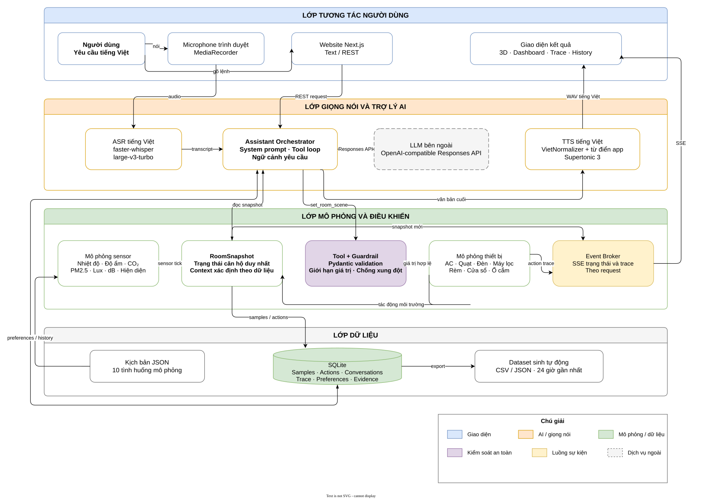
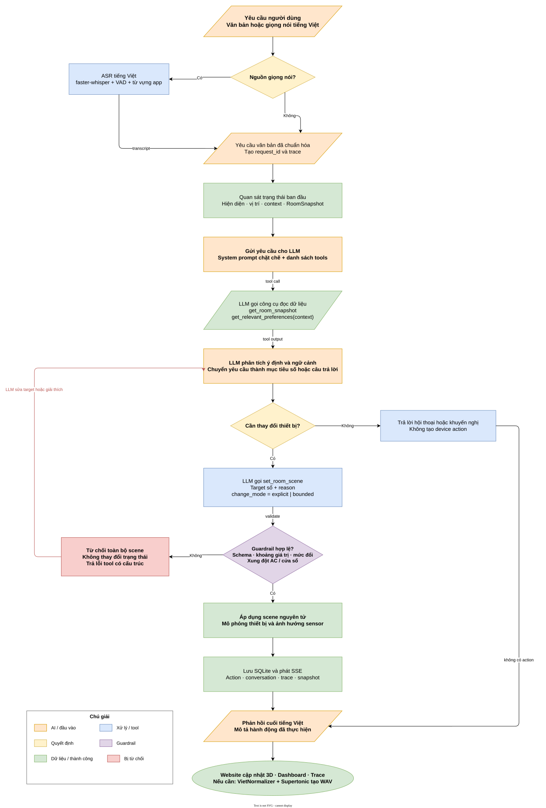
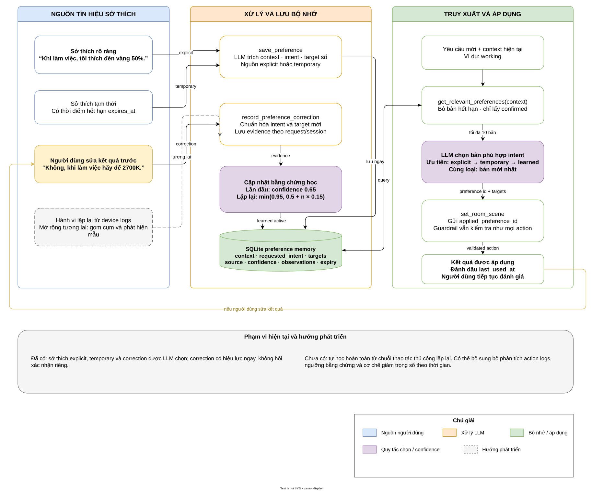

# BÁO CÁO XÁC ĐỊNH ĐỀ TÀI


## Tóm tắt

FlatMate Comfort là hệ thống AIoT mô phỏng căn hộ thông minh. Hệ thống nhận yêu cầu tiếng Việt bằng văn bản hoặc giọng nói, kết hợp dữ liệu cảm biến, trạng thái thiết bị, ngữ cảnh hoạt động và sở thích cá nhân để tạo tập cấu hình số cho thiết bị. Ví dụ, yêu cầu “phòng rất nóng” có thể được chuyển thành nhiệt độ điều hòa 24°C và quạt mức 1 thay vì một lệnh bật/tắt cố định.

Toàn bộ cảm biến và thiết bị được mô phỏng bằng Python cùng dataset sinh có kiểm soát; không cần phần cứng thật. Website thể hiện căn hộ 3D, vị trí thiết bị, số liệu cảm biến, biểu đồ 24 giờ, bảng điều khiển và từng bước xử lý của trợ lý. LLM chọn công cụ và mục tiêu thiết bị, nhưng backend vẫn kiểm tra kiểu dữ liệu, giới hạn vận hành và xung đột trước khi cập nhật mô phỏng.

**Từ khóa:** AIoT, IoT, căn hộ thông minh, LLM, mô phỏng cảm biến, điều khiển thiết bị, sở thích người dùng, digital twin.

## 1. Bối cảnh và lý do chọn đề tài

Hệ thống nhà thông minh truyền thống thường dựa trên lệnh trực tiếp hoặc luật cố định, ví dụ “bật điều hòa”, “nếu nhiệt độ lớn hơn 30°C thì bật quạt”. Cách tiếp cận này dễ triển khai nhưng chưa xử lý tốt yêu cầu tự nhiên và phụ thuộc ngữ cảnh như:

- “Phòng hơi khó chịu.”
- “Tôi chuẩn bị làm việc.”
- “Không khí ngột ngạt.”
- “Tắt hết trước khi tôi đi ra ngoài.”

Cùng một câu có thể cần kết quả khác nhau tùy nhiệt độ, độ ẩm, CO₂, PM2.5, vị trí người dùng, cửa sổ, trạng thái thiết bị và sở thích đã học. Vì vậy, đề tài xây dựng lớp phiên dịch thông minh nằm giữa người dùng và hệ thống IoT:

```text
Yêu cầu ngôn ngữ tự nhiên
+ dữ liệu cảm biến
+ trạng thái thiết bị
+ ngữ cảnh hoạt động
+ sở thích cá nhân
        ↓
Tập giá trị điều khiển thiết bị
```

Đề tài phù hợp môn IoT vì vẫn có đủ chu trình `sensing → communication → processing → actuation → monitoring`, nhưng thay cảm biến và cơ cấu chấp hành thật bằng mô phỏng Python để tập trung vào logic điều phối AIoT, dữ liệu và giao diện digital twin.

## 2. Phát biểu bài toán

### 2.1. Bài toán chính

Xây dựng hệ thống có khả năng biến yêu cầu tiếng Việt thành một tập mục tiêu thiết bị phù hợp với trạng thái căn hộ tại thời điểm yêu cầu.

Có thể mô tả đầu ra bằng hàm:

```text
A = f(R, S, D, C, P, H)
```

Trong đó:

- `R`: yêu cầu văn bản hoặc transcript giọng nói.
- `S`: dữ liệu cảm biến môi trường và hiện diện.
- `D`: trạng thái thiết bị hiện tại.
- `C`: ngữ cảnh như làm việc, thư giãn, ngủ hoặc vắng nhà.
- `P`: sở thích đang có hiệu lực.
- `H`: hành động và hội thoại gần đây.
- `A`: tập giá trị thiết bị cần áp dụng.

### 2.2. Đầu vào

| Nhóm | Dữ liệu |
| --- | --- |
| Yêu cầu người dùng | Văn bản tiếng Việt hoặc âm thanh từ microphone |
| Môi trường | Nhiệt độ, độ ẩm, CO₂, PM2.5, ánh sáng, tiếng ồn |
| Hiện diện | Có người trong phòng, tại bàn, trên giường |
| Trạng thái mở | Cửa sổ, vị trí rèm |
| Thiết bị | Điều hòa, quạt, đèn, máy lọc, thiết bị độ ẩm, máy tính, màn hình, ổ cắm |
| Bộ nhớ | Sở thích rõ ràng, tạm thời và sở thích học từ correction |

### 2.3. Đầu ra

Đầu ra không chỉ là tên thiết bị. Hệ thống tạo cấu hình có kiểu và miền giá trị rõ ràng, ví dụ:

```json
{
  "change_mode": "bounded",
  "ac_power": true,
  "ac_temperature_c": 24,
  "fan_power": true,
  "fan_speed": 1,
  "window_state": "closed",
  "reason": "Phòng nóng và ẩm; giảm nhiệt độ trong giới hạn an toàn."
}
```

## 3. Mục tiêu đề tài

### 3.1. Mục tiêu tổng quát

Xây dựng nguyên mẫu AIoT cá nhân hóa có thể hiểu yêu cầu tiếng Việt, đọc trạng thái căn hộ, chọn hành động thiết bị hợp lệ, mô phỏng tác động và trình bày toàn bộ kết quả trên website.

### 3.2. Mục tiêu cụ thể

1. Sinh dữ liệu cảm biến xác định được bằng Python và lưu lịch sử 24 giờ.
2. Mô phỏng thiết bị, trạng thái người dùng và tác động qua lại giữa thiết bị với môi trường.
3. Dùng LLM để hiểu toàn bộ câu và chọn structured tool call, không phân loại ý định bằng danh sách từ khóa backend.
4. Kiểm tra mọi mục tiêu bằng guardrail trước khi thay đổi trạng thái.
5. Hỗ trợ yêu cầu văn bản, push-to-talk tiếng Việt và phản hồi TTS tiếng Việt.
6. Lưu và áp dụng sở thích theo context và intent.
7. Hiển thị căn hộ 3D, dashboard, biểu đồ, device controls, trace và lịch sử hội thoại.
8. Giữ hệ thống chạy được khi không có thiết bị IoT vật lý.

## 4. Phạm vi

### 4.1. Trong phạm vi

- Một người dùng và một căn hộ studio cố định.
- Khu vực làm việc, phòng ngủ, sinh hoạt, cửa sổ; bếp và phòng tắm chỉ để minh họa không gian.
- Cảm biến, thiết bị và dữ liệu đều được mô phỏng.
- Giao tiếp web qua REST và Server-Sent Events (SSE).
- LLM qua OpenAI-compatible Responses API với structured tools.
- SQLite cho lịch sử, hội thoại, trace và preference.
- Giao diện tiếng Việt, responsive trên desktop, tablet và mobile.

### 4.2. Ngoài phạm vi

- Kết nối ESP32, Raspberry Pi, MQTT, Home Assistant hoặc thiết bị thật.
- Camera, khóa cửa, báo cháy, báo gas, cảnh báo khẩn cấp.
- Nhiều căn hộ, nhiều người dùng hoặc xác thực tài khoản.
- Hệ thống điều khiển an toàn cấp công nghiệp.
- Tự học hoàn toàn từ hành vi dài hạn mà không có correction; đây là hướng phát triển.

## 5. Thành phần IoT được mô phỏng

### 5.1. Cảm biến

| Dữ liệu mô phỏng | Thiết bị thật tương đương | Vai trò trong quyết định |
| --- | --- | --- |
| Nhiệt độ, độ ẩm | SHT31, BME280 | Điều hòa, quạt, hút ẩm hoặc tạo ẩm |
| CO₂ | SCD40, SCD41 | Phát hiện phòng bí; ưu tiên thông gió |
| PM2.5 | PMS5003, SEN55 | Điều khiển máy lọc không khí |
| Ánh sáng | BH1750 | Độ sáng đèn và vị trí rèm |
| Tiếng ồn | Microphone/SPL sensor | Đánh giá độ ồn của môi trường và thiết bị |
| Hiện diện | mmWave LD2410/LD2450 | Xác định có người, làm việc, ngủ hoặc vắng nhà |
| Giường, bàn | Pressure/occupancy sensor | Xác định vùng hoạt động |
| Cửa sổ | Contact sensor | Tránh bật điều hòa khi cửa sổ mở |
| Công suất | Smart plug/power meter | Theo dõi máy tính, màn hình và ổ cắm |

Các tên phần cứng trên chỉ thể hiện khả năng ánh xạ sang mô hình IoT thật. Phiên bản hiện tại không giao tiếp với các thiết bị này.

### 5.2. Thiết bị chấp hành

| Thiết bị | Thuộc tính điều khiển |
| --- | --- |
| Điều hòa | Bật/tắt, mode, 18–30°C, fan mode |
| Quạt | Bật/tắt, tốc độ 0–3, đảo gió |
| Đèn chính, đèn đầu giường | Bật/tắt, độ sáng 0–100%, nhiệt màu 2700–6500K |
| Máy lọc không khí | Bật/tắt, tốc độ 0–3 |
| Rèm | Vị trí 0–100% |
| Cửa sổ | Mở hoặc đóng |
| Thiết bị độ ẩm | Tạo ẩm/hút ẩm, mục tiêu 35–70% |
| Máy tính, màn hình | Bật/tắt qua smart plug mô phỏng |

## 6. Kiến trúc hệ thống



Nguồn chỉnh sửa: [`docs/diagrams/aiot-system-architecture.drawio`](docs/diagrams/aiot-system-architecture.drawio).

Kiến trúc gồm bốn lớp:

1. **Tương tác người dùng:** website Next.js nhận text/audio và hiển thị 3D, dashboard, trace, history.
2. **Giọng nói và trợ lý AI:** faster-whisper nhận dạng tiếng Việt; Assistant Orchestrator quản lý tool loop; LLM chọn hành động; VietNormalizer và Supertonic tạo âm thanh phản hồi.
3. **Mô phỏng và điều khiển:** Python duy trì `RoomSnapshot`, sinh sensor, kiểm tra guardrail, áp dụng device action và phát SSE.
4. **Dữ liệu:** SQLite lưu samples, actions, conversations, traces, preferences và evidence; JSON định nghĩa kịch bản; CSV/JSON chứa dataset sinh tự động.

### 6.1. Lựa chọn kiến trúc

- **SSE thay WebSocket:** server chủ yếu đẩy snapshot và trace; lệnh điều khiển vẫn dùng REST.
- **SQLite thay hệ quản trị phân tán:** một người dùng và một process mô phỏng chưa cần Redis/PostgreSQL.
- **Trạng thái hiện tại trong memory:** giảm độ phức tạp; SQLite giữ lịch sử và bộ nhớ lâu dài.
- **Frontend và backend tách rời:** frontend có thể triển khai tĩnh trên Netlify; backend cần process lâu dài, volume ghi được và tài nguyên cho ASR/TTS.

## 7. Quy trình xử lý yêu cầu



Nguồn chỉnh sửa: [`docs/diagrams/request-to-device-flow.drawio`](docs/diagrams/request-to-device-flow.drawio).

Luồng chính:

1. Người dùng nhập text hoặc nhấn microphone để bắt đầu và nhấn lần nữa để gửi.
2. Nếu là audio, backend dùng faster-whisper để tạo transcript tiếng Việt.
3. Backend tạo `request_id`, đọc snapshot và context hiện tại, sau đó phát trace quan sát được.
4. LLM nhận system prompt và danh sách công cụ.
5. LLM gọi `get_room_snapshot` và, khi có bộ nhớ, `get_relevant_preferences(context)`.
6. LLM tự xác định ý định từ toàn bộ câu, dữ liệu sensor và preference.
7. Nếu cần điều khiển, LLM gọi `set_room_scene` với mục tiêu số.
8. Pydantic và guardrail kiểm tra toàn bộ scene. Scene sai bị từ chối mà không làm thay đổi một phần trạng thái.
9. Scene hợp lệ được áp dụng vào mô phỏng, ghi SQLite và phát snapshot/trace qua SSE.
10. Website cập nhật 3D, dashboard và phản hồi cuối; TTS được gọi nếu người dùng bật đọc phản hồi.

## 8. Mô phỏng và dataset

### 8.1. Tính xác định

- Seed mặc định: `42`.
- Mỗi 2 giây thực tương ứng 1 phút mô phỏng.
- Reset khôi phục seed, thời gian, trạng thái và chuỗi dữ liệu tương lai giống nhau.
- Hệ thống tạo trước 24 giờ baseline với tần suất một mẫu mỗi phút.
- Dashboard chỉ đọc tối đa 24 giờ gần nhất và hỗ trợ hover theo mốc thời gian.

Mỗi giá trị môi trường được cập nhật theo dạng tổng quát:

```text
x(t+1) = clamp(x(t) + daily_drift + device_effect + seeded_noise)
```

Ví dụ:

- Có người và cửa sổ đóng làm CO₂ tăng.
- Cửa sổ mở làm CO₂ giảm nhanh hơn.
- Máy lọc giảm PM2.5 nhưng không loại bỏ CO₂.
- Điều hòa đưa nhiệt độ dần về target.
- Quạt, điều hòa và máy lọc làm thay đổi độ ồn.
- Rèm và thời gian trong ngày ảnh hưởng ánh sáng môi trường.

### 8.2. Kịch bản dữ liệu

Hệ thống có 10 kịch bản JSON: `working`, `relaxing`, `sleeping`, `reading_in_bed`, `hot_room`, `stuffy_air`, `polluted_air`, `strong_sunlight`, `quiet_comfort` và `empty_room`.

Kịch bản chỉ thiết lập dữ liệu đầu vào mô phỏng. Mọi action trong kịch bản vẫn đi qua cùng đường kiểm tra trạng thái như thao tác thủ công và hành động của trợ lý.

## 9. LLM, tool call và guardrail

### 9.1. Vai trò của LLM

LLM không trực tiếp sửa biến Python và không được quyền bỏ qua validation. Vai trò của LLM:

- Hiểu tiếng Việt và ý nghĩa toàn câu.
- Quyết định cần đọc dữ liệu hoặc bộ nhớ nào.
- Chọn công cụ phù hợp.
- Chuyển ý định thành giá trị có cấu trúc.
- Giải thích ngắn kết quả hoặc hỏi lại khi yêu cầu chưa đủ rõ.

Backend không dùng danh sách từ khóa như “relaxing” để phân loại câu người dùng. Context mô phỏng được xác định từ dữ liệu hiện diện; LLM dùng toàn bộ câu để hiểu intent và chọn tool.

### 9.2. Công cụ chính

| Tool | Chức năng |
| --- | --- |
| `get_room_snapshot` | Đọc sensor, openings, occupancy, power và device state |
| `get_recent_actions` | Đọc các thay đổi gần đây khi câu lệnh nhắc đến hành động trước |
| `get_relevant_preferences` | Lấy preference theo context đang hiểu |
| `save_preference` | Lưu sở thích explicit hoặc temporary |
| `record_preference_correction` | Lưu correction và tăng bằng chứng học |
| `set_room_scene` | Đề xuất một tập mục tiêu thiết bị nguyên tử |

### 9.3. Guardrail

| Quy tắc | Giá trị hiện tại |
| --- | --- |
| Nhiệt độ điều hòa | 18–30°C |
| Yêu cầu cảm tính: thay đổi AC tối đa mỗi action | 2°C |
| Yêu cầu cảm tính: thay đổi quạt/máy lọc | 1 mức |
| Yêu cầu cảm tính: thay đổi độ sáng/rèm | 20% |
| Cửa sổ mở | Điều hòa phải tắt |
| Bật điều hòa/làm lạnh | Cửa sổ được đóng |
| Tắt thiết bị có level | Level được chuẩn hóa về 0 |
| Scene có trường sai | Từ chối toàn bộ, không cập nhật một phần |

`change_mode="explicit"` dùng khi người dùng nêu rõ trạng thái hoặc giá trị. `change_mode="bounded"` dùng cho câu cảm tính như “hơi nóng” hoặc “sáng hơn một chút”. Với bounded, hệ thống áp dụng ngay mức tối đa an toàn thay vì chỉ từ chối vì target ban đầu quá lớn.

## 10. Học sở thích cá nhân



Nguồn chỉnh sửa: [`docs/diagrams/preference-learning-loop.drawio`](docs/diagrams/preference-learning-loop.drawio).

### 10.1. Cơ chế hiện tại

Hệ thống có ba nhóm preference:

- **Explicit:** người dùng yêu cầu ghi nhớ rõ ràng; confidence `1.0`.
- **Temporary:** giống explicit nhưng có `expires_at`.
- **Learned:** hình thành khi người dùng sửa kết quả trước đó; có evidence và observation count.

Correction đầu tiên tạo learned preference với confidence `0.65`. Các lần lặp tiếp theo cập nhật:

```text
confidence = min(0.95, 0.5 + observation_count × 0.15)
```

Preference correction có hiệu lực ngay khi LLM xác định đây là sở thích hữu ích; không yêu cầu một hộp thoại xác nhận riêng. Khi truy xuất, hệ thống lọc theo context, trạng thái confirmed và thời gian hết hạn. LLM chỉ dùng preference nếu `requested_intent` phù hợp yêu cầu hiện tại.

Thứ tự ưu tiên:

```text
explicit → temporary → learned
```

Trong cùng nhóm và cùng phạm vi, bản cập nhật mới hơn được ưu tiên.

### 10.2. Mở rộng học từ hành vi

Phiên bản hiện tại chưa tự kết luận sở thích chỉ từ chuỗi thao tác thủ công. Hướng mở rộng:

1. Tạo feature từ context, sensor trước hành động và target sau hành động.
2. Nhóm các action có cùng intent và điều kiện gần nhau.
3. Chỉ tạo candidate khi mẫu lặp đủ số lần trong nhiều phiên.
4. Giảm trọng số evidence cũ theo thời gian.
5. So sánh candidate với preference explicit để tránh ghi đè mong muốn người dùng.
6. Vẫn chạy target qua guardrail trước khi áp dụng.

## 11. Giao diện website

### 11.1. Digital twin 3D

- Thể hiện các vùng căn hộ, người dùng, nội thất, sensor và vị trí thiết bị.
- Cho phép chọn ngữ cảnh làm việc, phòng khách, đọc trên giường, ngủ và ra ngoài.
- Overlay riêng cho nhiệt độ, không khí, ánh sáng, tiếng ồn và thiết bị.
- Có bảng trạng thái văn bản tương đương khi WebGL không khả dụng.

### 11.2. Dashboard

- Tile số liệu cho nhiệt độ, độ ẩm, CO₂, PM2.5, lux và dB.
- Biểu đồ nhiệt độ, CO₂, PM2.5 trong 24 giờ gần nhất.
- Hover xem timestamp và giá trị từng mốc.
- Bảng điều khiển chung cho thiết bị.
- Cập nhật trực tiếp bằng SSE.

### 11.3. Assistant trace và history

Trace chỉ hiển thị dữ liệu quan sát được, trạng thái tool và lý do ngắn; không hiển thị chain-of-thought nội bộ của mô hình.

Chuỗi sự kiện điển hình:

```text
request received
→ context observed
→ snapshot read
→ preference lookup
→ model request
→ tool requested
→ validation
→ state applied
→ final response
```

Trang history lưu yêu cầu text/voice, phản hồi cuối, trạng thái completed/failed và thời gian.

## 12. Xử lý giọng nói tiếng Việt

### 12.1. ASR

- Trình duyệt ghi audio bằng `MediaRecorder`.
- Backend dùng `faster-whisper` với model `large-v3-turbo`.
- Ngôn ngữ được cố định là tiếng Việt.
- Chạy CPU `int8`, beam size 5, có VAD và hotwords tên thiết bị.
- Wake phrase `Hey FlatMate` là tùy chọn; push-to-talk vẫn là luồng chính.

### 12.2. TTS

```text
Phản hồi LLM
→ từ điển riêng của ứng dụng
→ chuẩn hóa số và đơn vị
→ VietNormalizer
→ Supertonic 3, lang="vi", voice F1
→ WAV phát trong trình duyệt
```

Cấu hình mặc định dùng 10 bước tổng hợp và speed `1.15`. Nếu TTS lỗi, hành động thiết bị vẫn hoàn tất và văn bản cuối vẫn hiển thị.

## 13. Kịch bản minh họa

### 13.1. Phòng rất nóng

```text
Yêu cầu: “Phòng rất nóng.”
Trạng thái: 29°C, độ ẩm 72%, AC 26°C, quạt tắt, cửa sổ đóng.
Kết quả bounded: AC 24°C, quạt mức 1, cửa sổ giữ đóng.
```

Hệ thống giảm AC tối đa 2°C trong một action cảm tính và áp dụng ngay thay vì báo không thể thực hiện.

### 13.2. CO₂ cao

```text
Yêu cầu: “Không khí ngột ngạt.”
Trạng thái: CO₂ 1800 ppm, PM2.5 thấp, cửa sổ đóng, AC bật.
Kết quả: mở cửa sổ và tắt AC trong cùng scene.
```

Máy lọc không khí không được mô tả là thiết bị loại bỏ CO₂. PM2.5 và CO₂ được xử lý bằng hai logic khác nhau.

### 13.3. Tắt toàn bộ thiết bị điện

```text
Yêu cầu: “Tôi đi ra ngoài, tắt hết tất cả.”
Kết quả: tắt AC, quạt, đèn, máy lọc, thiết bị độ ẩm, máy tính, màn hình và ổ cắm.
Rèm và cửa sổ giữ nguyên nếu người dùng không yêu cầu.
```

## 14. Tiêu chí đánh giá

| Nhóm đánh giá | Chỉ số đề xuất | Cách kiểm tra |
| --- | --- | --- |
| Hiểu yêu cầu | Tỷ lệ chọn đúng tool và đúng nhóm thiết bị | Bộ câu lệnh tiếng Việt có expected action |
| Giá trị đầu ra | Tỷ lệ target đúng schema và hợp lý với sensor | So sánh với expected ranges |
| Guardrail | Tỷ lệ chặn đúng action sai; không false-negative nghiêm trọng | Test biên và test xung đột AC/cửa sổ |
| Tính nguyên tử | State không đổi khi một trường trong scene sai | Snapshot trước/sau request lỗi |
| Mô phỏng | Reset cùng seed sinh chuỗi giống nhau | So sánh dataset hash hoặc mẫu |
| Preference | Tỷ lệ dùng đúng preference theo context và intent | Kịch bản lưu, áp dụng, correction, expiry |
| ASR | WER/CER trên bộ câu lệnh tiếng Việt | Transcript so với ground truth |
| Độ trễ | ASR, LLM, tool loop, TTS và tổng thời gian | Timestamp trong trace |
| Giao diện | Không overflow; usable trên desktop/tablet/mobile | Browser smoke và kiểm tra thủ công |
| Khả năng phục hồi | Text vẫn dùng được khi mic/TTS/WebGL lỗi | Test failure paths |

## 15. Công nghệ sử dụng

| Thành phần | Công nghệ |
| --- | --- |
| Frontend | Next.js 16, React 19, TypeScript |
| 3D | Three.js, React Three Fiber, Drei |
| Backend | Python 3.11, FastAPI, Pydantic |
| Realtime | Server-Sent Events |
| Database | SQLite |
| LLM | OpenAI-compatible Responses API, structured function tools |
| ASR | faster-whisper `large-v3-turbo` |
| TTS | VietNormalizer, từ điển app, Supertonic 3 |
| Dataset | Python, CSV, JSON |
| Kiểm thử | Pytest, Ruff, TypeScript check, smoke scripts |
| Triển khai | Netlify cho frontend; backend persistent triển khai riêng |

## 16. Kết quả hiện tại

- Phase 0–6 đã hoàn thành: cấu trúc, runtime, simulation, storage, 3D, dashboard, LLM tools, voice, preference và history.
- Phase 7 đang hoàn thiện kiểm thử tích hợp, hiệu năng và failure paths.
- Backend test, TypeScript check và production build đã có trong quy trình `make check`.
- Frontend đã triển khai trên Netlify; chức năng realtime cần URL backend công khai.
- Toàn bộ thay đổi thiết bị chỉ ảnh hưởng mô phỏng Python.

## 17. Hạn chế và hướng phát triển

1. Thay simulation adapters bằng MQTT/device adapters để kết nối phần cứng thật.
2. Thêm bộ học hành vi thụ động từ action logs với ngưỡng bằng chứng rõ ràng.
3. Xây dựng bộ dataset câu lệnh tiếng Việt có nhãn để đo intent accuracy và WER.
4. Thêm kiểm thử browser end-to-end cho microphone, SSE reconnect và WebGL fallback.
5. Đóng gói backend bằng container và triển khai trên dịch vụ có persistent volume.
6. Thêm nhiều phòng và nhiều người dùng sau khi mô hình một căn hộ ổn định.

## 18. Kết luận

FlatMate Comfort chứng minh một hướng tiếp cận AIoT trong đó LLM hoạt động như lớp chuyển đổi giữa ngôn ngữ tự nhiên và cấu hình thiết bị. Dữ liệu cảm biến cung cấp ngữ cảnh, preference tạo tính cá nhân hóa, guardrail giữ miền điều khiển hợp lệ, còn digital twin giúp quan sát kết quả. Việc mô phỏng toàn bộ thiết bị bằng Python giảm chi phí phần cứng nhưng vẫn giữ được chu trình cốt lõi của một hệ thống IoT hoàn chỉnh.

